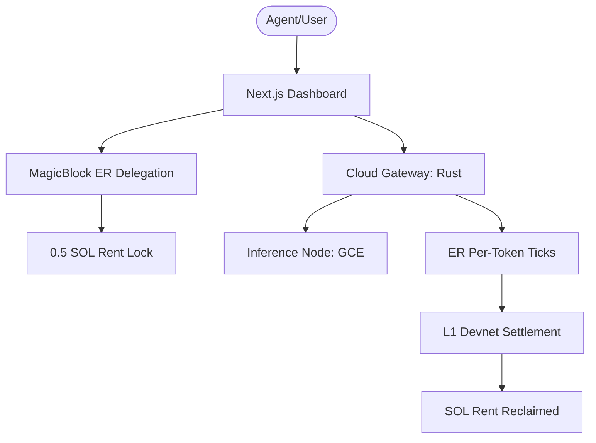

# ZeroRouter 🌊 — AI Inference at the Speed of Light

**ZeroRouter** is a high-performance, decentralized API gateway built for the **Solana Blitz Hackathon**. It enables **True Per-Token Micropayments** for AI inference using **MagicBlock Ephemeral Rollups**.

## 🚀 The Vision
Autonomous agents should not be throttled by credit card limits or monthly subscriptions. ZeroRouter allows agents to stream tokens and pay for them in real-time, exactly like a utility bill—settling every single token chunk on-chain with zero gas fees and sub-millisecond latency.

## 🏆 Why ZeroRouter Wins

### 1. Market Disruption: The "OpenRouter" Killer
- **Traditional (OpenRouter/ChatGPT)**: Requires centralized credit systems, monthly subscriptions, and trust in a middleman to account for usage.
- **ZeroRouter**: 100% Decentralized. You pay exactly what you burn, settled in real-time on-chain. No deposits held by a centralized entity.

### 2. Technical Execution: The Ultimate MagicBlock Showcase
- **Ephemeral Rollups (ER)**: We utilize ER for the most demanding use case—**token streaming.** Every single token processed is recorded on an ER tick (Gasless), providing the throughput of a centralized server with the security of a blockchain.
- **Zero-Friction UX**: A true "Pay-as-you-Inference" experience where the user (or agent) never has to sign 1000 transactions manually. The ER handles the delegation, providing sub-millisecond accounting.

### 3. Performance & Security
- **Sovereign Rust Core**: Built from scratch using Axum and Tokio for <10ms response times.
- **Minimal Footprint**: Gateway runs in a SCRATCH-based Docker image for a near-zero attack surface.

## 🏗️ System Architecture

## 🚀 Devnet Demo Handshake
The system is live and pre-configured for a **Zero-Friction Demo**. 

### 📺 Live Branding
-   **Main Site**: **[https://zerorouter.xyz](https://zerorouter.xyz)**
-   **API Endpoint**: **[https://api.zerorouter.xyz](https://api.zerorouter.xyz)**
-   **Status**: Managed via Cloudflare with full SSL/TLS encryption.

### 🧪 DEVNET DEMO WALLET
- **Public Key**: `2gzjbVH1DN71s5Csf1fkxDpjJJLesB174Yr2xRkyGSgm`
- **Setup**: fund this address on devnet to activate the live state-settlement visualization.

### 🤖 AI Agent Integration
Agents can discover and use this protocol via the **[AI Skill Specification](./skill.md)**.

---
Built with 🦀 and ⚡ for the Sovereign Agent Economy.
© 2026 ZeroRouter Protocol.
